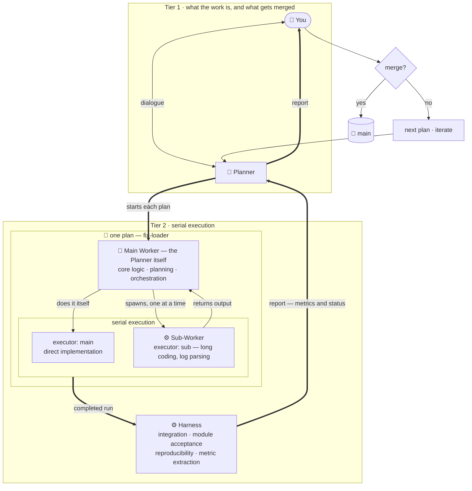
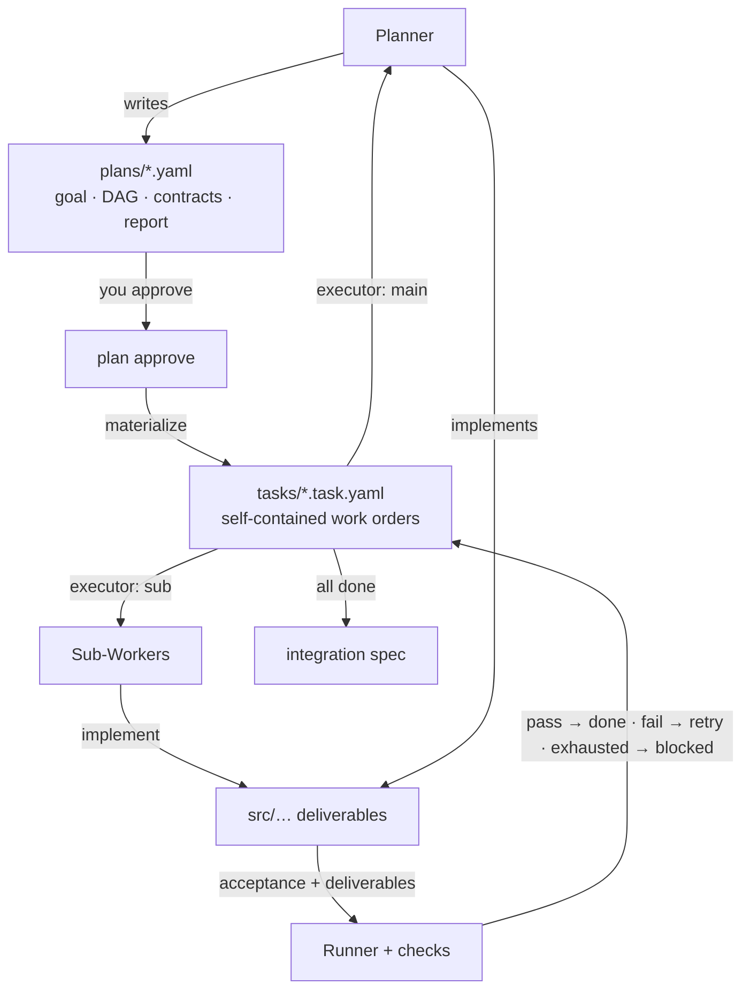
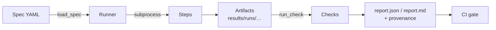

# Harness Template

An agent-first harness for **work you need to be able to trust**: a Planner you
talk to, Sub-Workers it delegates to, and machine-checked verification of
whatever comes out of either.

## Getting started

You and the Planner talk about what you want done. It writes a plan, explains
it, and — once you agree — builds it: some modules itself, the routine bulk
handed to Sub-Workers. Each plan lives on its own git branch. When it
is finished you get a report — did integration pass, which modules were built,
does it reproduce, and the numbers you asked for — and **you** decide whether to
merge. The harness measures; it never decides.

Lost at any point:

```bash
python -m harness status     # reads the real state, names the next command
```

### 0. Quickstart

```bash
# 1. Install:
pip install git+https://github.com/teasol/harness-template.git

# 2. Initialize in your project:
cd my-project
harness init                                   # scaffolds AGENTS.md, agents/, configs/

# 3. Create the Planner you will work with:
harness create -n my-planner                   # --model / --effort optional
```

**Using uv?** Add the harness to the project you are about to initialize (which
needs a `pyproject.toml` — run `uv init` first if it has none), and run every
harness command through `uv run`:

```bash
cd my-project
uv add git+https://github.com/teasol/harness-template.git
uv run harness init                            # scaffolds AGENTS.md, agents/, configs/
uv run harness create -n my-planner            # --model / --effort optional
```

Every `python -m harness ...` below is then `uv run harness ...` — same
commands, resolved against the project's environment. **You do not have to
translate them yourself:** every command the harness prints — init's next
steps, the Planner's briefing, the block you paste into a Planner session, the
scaffolded `AGENTS.md` — carries the prefix that matches how you invoked it. For
a harness you want available outside any one project, `uv tool install
git+https://github.com/teasol/harness-template.git` puts `harness` on your PATH
instead.

`harness init` scaffolds the role contracts (`agents/`), platform configuration
(`configs/`), and asks which agent runs your **Sub-Workers**. The Planner is not
configured, because the Planner is the session you are already talking to.

**Adopting an existing project?** That is the normal case, and `harness init`
notices: it records how the harness arrived — the commit, and how many source
files predate it, so "not verified yet" has a boundary instead of being a
feeling — and prints the order that works.

```bash
harness create -n <planner-name>                # the Planner you will talk to
harness project init                            # what it must know here — it can write this
```

Then tell that Planner what you want done. It agrees the work with you and
starts the plan itself — `harness plan new` is its command, not yours.

**The Planner comes first, even here.** Registering one is the only step that is
always yours to run; writing down what the project expects is work the Planner
does once it is open and reading its own briefing.

The first Planner's briefing opens with the situation: none of this code is
covered by a contract or an acceptance check yet, and making it verifiable is
its first job. **The harness does not prescribe how to modularize an existing
codebase** — deciding the decomposition is the Planner's work, and a pipeline
baked into the tool would be wrong for the next project anyway. See
[docs/plans.md](docs/plans.md#adopting-an-existing-project).

### 1. Create a Planner, and let it start the plan

**The Planner comes first, and it outlives any one plan.**

```bash
python -m harness create -n my-planner --model <model> --effort high
```

You then talk to that Planner, and *it* starts the plan once you agree what the
work is:

```bash
python -m harness plan new fix-loader --planner my-planner   # the Planner runs this
```

`--model` is optional: it defaults to whatever the Planner tier records, and a
Planner you drive by hand legitimately has none until its session says what it
is (`harness planner set <name> --model <model>`). Until then every report under
it notes that the run cannot be compared with another.

Starting a plan creates the git branch, an isolated working directory (a git
*worktree*) under `.worktrees/`, a plan skeleton, and prints the briefing:

```text
Plan 'fix-loader' created, worktree at /path/to/project/.worktrees/fix-loader.
Its Planner is 'my-planner'. Everything below is that Planner's briefing —
follow it, or hand this session to whoever will.

======================================================================
# Planner briefing: fix-loader

## The work

No goal written yet. Work out with the user what this plan is for:
what they want done, what would count as done, what they want to see at
the end. Then write it as the plan's `goal` — one paragraph, in the
words you would use out loud — and explain the plan before building it.
...
```

**There is no question to record and no form to fill in.** You talk; the Planner
writes what you agreed as the plan's `goal`, and the report answers to that.

### 2. Stay oriented

```bash
python -m harness planner brief fix-loader
```

The same briefing, re-read from current state. It always has the same sections
— **The work**, **State**, **Next**, **Your role** — so you skim it rather than
re-read it, and `Next` always names the one command to run now.

### 3. Agree the plan, then let it be built

The Planner drafts a plan, validates it, and **explains it to you**: what it
will establish, each module and who builds it, why this decomposition rather
than the obvious alternative, what it will cost, and what would make it fail.

```bash
python -m harness plan validate plans/fix-loader.yaml
python -m harness plan approve plans/fix-loader.yaml --by you   # you run this
python -m harness plan materialize plans/fix-loader.yaml
python -m harness plan run plans/fix-loader.yaml
```

**A plan is a proposal until you approve it, and `plan run` refuses to start on
one that nobody has.** Approving prints what it commits you to — the module list
and the worst-case agent time, which is otherwise invisible: two modules at six
attempts and a 30-minute cap is a six-hour ceiling. Approval is fingerprinted
against the plan's contents, so editing it lapses the approval. If the Planner
approves its own plan the report says so, because the point of the gate is that
somebody else saw it.

Each module says who builds it:

```yaml
executor: main   # the Planner does it — core logic, planning, orchestration
executor: sub    # a Sub-Worker does it — routine bulk a brief can fully specify
```

`plan run` hands `sub` modules to a Sub-Worker in dependency order, checks
acceptance **and** declared deliverables, and retries with the real failure
output. It stops early when it stops making progress: three attempts in a row
that change no deliverable hand back to the Planner rather than spend the rest
of the cap repeating one failure. A module that fails is `blocked`, and the
Planner has two real moves — fix the brief, or **take it over** (`executor:
main`, re-materialize with `--force`, build it itself). Either way the module
keeps its contract and its acceptance, so taking it over costs no verification.

**Watching a long run.** Steps and Sub-Worker attempts buffer their output until
they exit, so from a second terminal:

```bash
python -m harness progress --watch
```

```text
worker fix-loader-parse (module 1/2 · attempt 2/6) · running 12m30s · 17m30s before the cap
```

A heartbeat that stopped ticking is reported as **dead**, not slow — the
distinction you actually need during a long wait.

### 4. Read the report and decide

```bash
python -m harness report fix-loader --determinism --save
```

```text
[fix-loader] READY TO MERGE
  integration: PASSED
  tasks:       2/2 done
  determinism: REPRODUCIBLE
  commit:      1ebd0bed...
  retained_mass: 0.198128
```

**`READY TO MERGE` means the harness could not find anything wrong — not that
the result is any good.** That judgement is yours. `NOT READY` lists exactly
what is missing.

Then, if you want it:

```bash
git merge fix-loader
```

Nothing merges on your behalf. Decide against a plan and simply don't merge —
its git branch remains, so the attempt stays on the record.

### Running several at once

```bash
python -m harness plan new fix-loader --planner my-planner
python -m harness plan new new-metric --planner my-planner
python -m harness plans
```

One Planner can own several plans — that is why it is registered separately from
any of them. Each report stands on its own: a plan may not read another's
results, and the harness rejects a plan that tries. Comparing them is **your**
job, done by reading the finished reports.

### When something goes wrong

| Symptom | What it means |
| --- | --- |
| The briefing says **no goal written yet** | Talk it through, then write it as the plan's `goal`. |
| `plan validate` says "still the scaffold" | The TODOs have not been filled in yet. |
| `plan run` says **this plan has never been approved** | Read it, then `harness plan approve <plan> --by <you>`. Editing a plan lapses its approval. |
| A task is `blocked` | A Sub-Worker used up its attempts. Fix the brief, or take the module over with `executor: main`. |
| A task stopped after **3 attempts changed no deliverable** | The Sub-Worker is wedged, not slow. The brief or the acceptance is wrong. |
| A Sub-Worker exited in **under 5 seconds** | A misconfigured command, not a coding problem. `harness setup --check`. |
| A task aborted: **the Worker changed the harness** | Containment did its job. Acceptance under a rewritten harness proves nothing. |
| `report` says `NOT READY` | It lists every blocker. Fix them — or decide the plan failed, which is a valid outcome. |
| `NOT REPRODUCIBLE` | Something is unseeded. See [docs/reproducibility.md](docs/reproducibility.md). |
| A long run looks hung | `harness progress --watch` from another terminal. |
| `cost: not measured` | Expected. The harness does not estimate token spend. |
## Why

Work rots because verification is ad-hoc: "run this, eyeball the output." This
template makes verification a first-class artifact, then builds an agent
workflow on top of it:

- **Declarative** — what to run and what to check lives in YAML, not tribal memory.
- **Deterministic** — seeds are explicit; every run's artifacts are hash-compared.
  Declaring a seed does not silently change your numbers.
- **Enforced** — anything declared (deliverables, dependencies, report sources)
  is machine-checked. A rule the harness cannot check is prose, and prose is
  not a gate.
- **Measured, not narrated** — an agent says *where* a number lives; the
  harness reads the artifact. No result reaches you on an agent's word.
- **Contained** — a Sub-Worker that edits the harness, or a tracked file it never
  declared, fails the task. Acceptance run under a harness the agent just
  rewrote proves nothing, so this is enforced rather than asked.
- **Agreed before it is built** — a plan nobody approved cannot run.
- **Human at the end** — the harness reports readiness and stops. What gets
  merged is your decision, and the one thing here that is deliberately not
  automated.

## How it works

**Two tiers.** You and the Planner settle what the work is and you decide what
gets merged. Everything else happens inside one plan, where the Planner is
also the **Main Worker**: it implements the core work itself and delegates
routine bulk to a **Sub-Worker**, one at a time. One Planner runs many plans
over the life of a project.



The harness verifies whatever comes out, whoever produced it: a module the
Planner wrote itself carries the same contract and the same acceptance as one a
Sub-Worker built. What the split changes is who writes the code, never whether
it is checked.

### Tier 1 — plans and the merge decision

```bash
python -m harness create -n <planner> --model <model>   # a Planner, once
python -m harness plan new <name> --planner <planner>   # git branch + worktree
python -m harness planner brief <name>                  # current state, any time
python -m harness plans                                 # what is in flight
python -m harness report <name> --determinism --save
git merge <name>                                        # only you do this
```

A Planner made with `harness create` outlives one plan: it carries its model —
so a report is never "model not recorded" — and the notes it wrote in earlier
runs, which is the hour it spent learning the project not being paid twice.
`harness planner note <name> --add "..."` records something the next run should
not have to rediscover. Durable project policy belongs in
`configs/project.yaml` instead, which you own: one is a lab notebook, the other
is the rules.

`report` measures the spine itself — integration result, per-task acceptance
re-verified, determinism, the exact commit to merge, and an explicit list of
what went **unverified** — then extracts the metrics you asked for from real run
artifacts.

Full reference: [docs/plans.md](docs/plans.md).

### Tier 2 — plans, tasks, and Sub-Workers



Sub-Workers run **one at a time** within a plan. Isolation belongs at the plan
level: a plan's DAG is near-linear so concurrency buys little, while per-Worker
branches would fracture the task board and make dependency gates read
stale state.

- **Planner / Main Worker contract**: [agents/planner.md](agents/planner.md)
- **Sub-Worker contract**: [agents/worker.md](agents/worker.md)
- **Full reference**: [docs/orchestration.md](docs/orchestration.md)

### Choosing the Sub-Worker

```bash
python -m harness setup --list      # platforms available
python -m harness setup --check     # can it actually be driven?
python -m harness setup             # interactive, or:
python -m harness setup \
  --worker-platform opencode --worker-model deepseek/deepseek-v4-flash --worker-effort low
```

Only the Sub-Worker tier is configured. The Planner is the session you are
talking to — always manual, never spawned — so there is nothing to choose for
it. A Sub-Worker's task is bounded and fully specified, so a small fast model
usually suffices; that difference is the point of splitting the two.

Platforms that list models offer them by number rather than asking you to type
an exact id, because a wrong id does not fail at setup — it fails much later as
an agent that never runs. Free text is still accepted.

`setup --check` sends one cheap prompt and reports whether the agent actually
received it. A preset that does not match the installed CLI otherwise fails
silently: attempts ending in under a second each, with the agent never having
seen the task.

Platform knowledge lives in `configs/agent-platforms.yaml` as **data** — adding
your lab's tool, or a local model, is an entry there, not a change to
`harness/`.

## The verification layer

Everything above stands on one engine: a spec is an ordered list of steps, each
a shell command followed by checks.



```yaml
name: my-check
seed: 42                    # exports PYTHONHASHSEED; does NOT change your numbers
deterministic_math: false   # opt in to CUBLAS_WORKSPACE_CONFIG — this DOES change them
steps:
  - id: train
    run: ${HARNESS_PYTHON} scripts/train.py --seed ${HARNESS_SEED}
    timeout: 3600
    checks:
      - type: file_exists
        path: ${HARNESS_RESULTS_DIR}/metrics.json
      - type: json_metric
        path: ${HARNESS_RESULTS_DIR}/metrics.json
        metric: val.accuracy
        min: 0.5
```

A task's acceptance is a spec run by this same Runner, and a plan's report is
that machinery run over a whole plan. One engine, three altitudes.

Every report records its provenance — commit, dirty flag, interpreter, platform,
seed, and every environment variable the harness injected — so a result found
months later can be traced back to code. `seed:` seeds and nothing more:
deterministic GPU math constrains kernel selection and therefore changes
results, so it is opt-in via `deterministic_math` rather than something a seed
turns on behind your back.

`harness reproduce` runs a spec twice and diffs a hash manifest of **every**
artifact, and refuses to pass a spec that produced nothing to compare.

Full reference: [docs/verification.md](docs/verification.md) ·
[docs/reproducibility.md](docs/reproducibility.md).

## Everyday commands

```bash
make status        # where am I, what next
make verify        # run the verification spec end-to-end
make reproduce     # run it twice and diff every artifact (determinism gate)
make run           # put every ready task through a Sub-Worker
make test          # pytest suite
make lint          # ruff check + format check
make audit         # re-verify every task marked done
make drift         # validate every plan, fail on task/plan drift
make plans         # list plans in flight

python -m harness progress --watch   # what is running right now (second terminal)
```

## Project structure

```
harness-template/
├── AGENTS.md               # Agent-facing ground rules (read this first)
├── Makefile                # status / setup / verify / reproduce / run / audit / drift
├── pyproject.toml          # Project metadata + tool config
├── .worktrees/             # One worktree per plan in flight (gitignored)
├── .harness/               # Harness state that is not project code
│   ├── configs/agents.yaml #   the Sub-Worker tier (the Planner is you)
│   ├── configs/project.yaml#   authoritative docs, report format, conventions
│   ├── planners/           #   registered Planners and what they have learned
│   └── adoption.json       #   how the harness arrived, if code predated it
├── agents/                 # Role contracts
│   ├── planner.md          #   Planner = Main Worker: plans, and implements
│   └── worker.md           #   Sub-Worker: one module task, in isolation
├── plans/                  # Plans (Planner output)
├── tasks/                  # Materialized work orders + lifecycle
├── harness/                # The harness itself (stdlib + PyYAML only)
│   ├── spec.py             #   Spec loading & validation
│   ├── runner.py           #   Step execution engine
│   ├── checks.py           #   Built-in checks + registry
│   ├── report.py           #   JSON/Markdown report generation
│   ├── reproduce.py        #   Determinism gate: repeat a spec, diff artifacts
│   ├── reproducibility.py  #   Seeding, hashing, run provenance
│   ├── plan.py             #   Plans: module DAGs, contracts, approval
│   ├── task.py             #   Task lifecycle, board, deliverable enforcement
│   ├── worker.py           #   Sub-Worker adapters + the verify-and-retry loop
│   ├── guard.py            #   Containment: the harness is not the agent's to edit
│   ├── heartbeat.py        #   Where a run is right now, from another terminal
│   ├── plans.py            #   Plans in flight: worktrees, briefings, reports
│   ├── project.py          #   What a Planner must know about THIS project
│   ├── planners.py         #   Planners that outlive one plan, and their notes
│   ├── adoption.py         #   Landing on a codebase that already exists
│   ├── setup.py            #   Choosing the Sub-Worker platform / model / effort
│   └── cli.py              #   status | progress | setup | verify | plan | task | report
├── src/                    # Your code
├── scripts/                # Runnable steps
├── tests/                  # Pytest suite
├── docs/                   # Reference docs
├── integrations/           # Optional tool-specific shims (nothing required)
└── results/                # Run outputs & reports (gitignored)
```

## Creating a new project from this template

**Option A — GitHub UI:** click **"Use this template"**, then clone it.

**Option B — GitHub CLI:**

```bash
gh repo create <owner>/<new-project> --template teasol/harness-template --clone
cd <new-project>
python -m harness status
```

## Documentation

- [AGENTS.md](AGENTS.md) — ground rules every agent (and human) works under
- [docs/plans.md](docs/plans.md) — Tier 1: plans, Planners, adoption, reports
- [docs/orchestration.md](docs/orchestration.md) — Tier 2: plans, tasks, contracts
- [docs/verification.md](docs/verification.md) — specs, checks, `reproduce`
- [docs/reproducibility.md](docs/reproducibility.md) — determinism and provenance
- [docs/architecture.md](docs/architecture.md) — components and design rules
- [agents/planner.md](agents/planner.md) · [agents/worker.md](agents/worker.md) — role contracts
- [integrations/](integrations/README.md) — optional tool shims (nothing required)

## CI

- **CI** (`.github/workflows/ci.yml`): lint + tests on every push/PR.
- **Verification** (`.github/workflows/verify.yml`): the determinism gate
  (`harness reproduce`), plan validity and plan/task drift, re-verification of
  every task marked `done`, and the plan lifecycle. Reports are uploaded as
  build artifacts.
- **Pre-commit** (`.pre-commit-config.yaml`): the same gates locally — run
  `pre-commit install` once per checkout.
