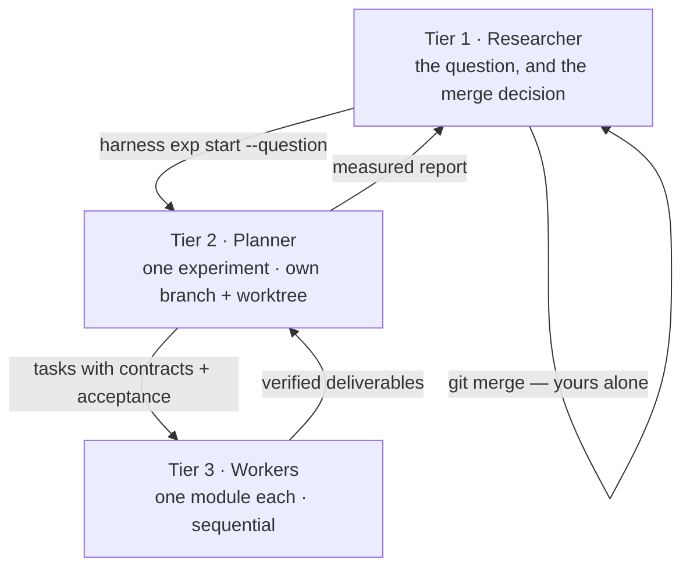
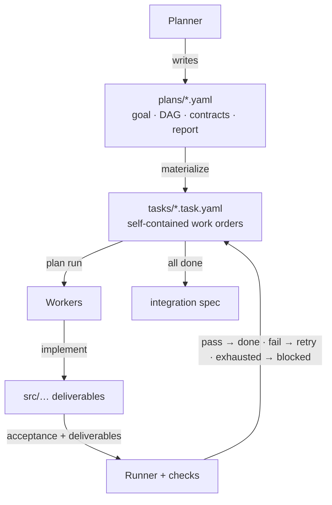
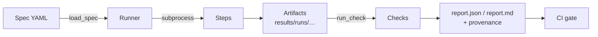

# Harness Template

Standard agent-first harness engineering template for **reproducible research**
and **automated verification workflows**.

## Getting started

You state a research question. An AI **Planner** breaks it into modules, hands
each to an AI **Worker**, and verifies the result. Every experiment lives on its
own git branch. When one finishes you get a report — did integration pass, which
modules were built, does it reproduce, and the numbers you asked for — and **you**
decide whether to merge. The harness measures; it never decides.

Lost at any point:

```bash
python -m harness status     # reads the real state, names the next command
```

### 0. See it work, then make it yours

```bash
python scripts/instantiate.py --exam-demo      # watch the whole flow on real output
python scripts/instantiate.py --name my-project
git add -A && git commit -m "chore: instantiate from harness-template"
make setup && make verify && make test         # install, then prove it works here
make agents-setup                              # which model runs each tier
```

`--exam-demo` runs the shipped example end to end — plan, board, acceptance,
integration, determinism — so you see the shape before adopting it.
Instantiating then removes that example: a project should not begin holding
someone else's finished task board.

`make agents-setup` is optional: skip it and the harness writes briefings for
you to hand to a session yourself. Run it and the harness spawns agents.

### 1. Start an experiment

An experiment is **one question** — but you do not have to have it phrased yet:

```bash
python -m harness exp start sparse-attention
```

A question usually gets sharper by talking it through, so the normal path is to
open the experiment, activate a Planner, work out together what is actually
being asked, and record it when it settles:

```bash
python -m harness exp question sparse-attention --set "<what you agreed on>"
```

The Planner's briefing tells it to do exactly that, and not to plan or spawn a
single Worker until you both agree. If you already know the question, pass it
up front instead — `exp start <name> --question "..."` — which is also what an
unattended `planner run` needs, since a spawned Planner has no one to ask.

Either way the question is stored verbatim, put at the top of the Planner's
briefing, and carried into the report.

This creates the branch `exp/sparse-attention` and a separate working directory
(a git *worktree*) under `.experiments/`. Several experiments coexist without
disturbing each other or your main checkout. It also writes a plan skeleton
full of `TODO`s — which is not yet a plan, and `plan validate` says so.

### 2. Get a Planner going

If the planner tier is configured (`harness setup`), spawn one:

```bash
python -m harness planner run sparse-attention
```

It invokes the Planner with its briefing and keeps going until the experiment
is reportable or the attempt cap is reached — the same verify-and-retry shape
as Workers, one altitude up. Use this when you are driving several experiments
and do not want to sit in each one.

Or open a session yourself and tell it, in your own words:

> You are the Planner for the `sparse-attention` experiment in `<path>`.
> Run `python -m harness planner brief sparse-attention --register session-01`
> and follow it exactly.
>
> The question: does keeping only the top 10% of attention weights preserve
> most of the attention mass? Report the retained mass and the fraction kept.

Add `--model <m> --effort <level>` to record which tier that Planner session
is running on. The harness cannot set a model for a session a person opened,
but recording it makes the tier split checkable.

The agent runs that command itself and gets its own briefing — which worktree
it owns, the rules, the current board, what to do next. Nothing to copy and
paste, and it can re-run the command whenever it needs current state.

State what you want reported in plain language. The Planner records **where
each number will come from**; the harness extracts the values from real run
artifacts. A number in your report was measured, never asserted.

### 3. Let the Planner work

It writes the plan, then:

```bash
python -m harness plan validate plans/sparse-attention.yaml
python -m harness plan materialize plans/sparse-attention.yaml   # one task per module
python -m harness plan run plans/sparse-attention.yaml           # Workers build them
```

`plan run` hands each module to a Worker, checks the result, and retries with
the actual failure output — up to 6 attempts. A module that still fails is
marked `blocked` and handed back to the Planner; that usually means the brief
or the contract is wrong, not that the Worker is bad.

**Agents are manual until you configure them.** Out of the box the harness
writes a briefing and stops. One command sets up both tiers:

```bash
python -m harness setup --list      # what's available
python -m harness setup             # interactive, or pass flags:
python -m harness setup \
  --planner-platform claude --planner-model opus  --planner-effort high \
  --worker-platform  claude --worker-model  haiku --worker-effort  low
```

It writes `configs/agents.yaml` with both tiers side by side, so the split is
visible. After it, `harness planner run <experiment>` spawns the Planner and
`plan run` builds each module — no human in between.

Already have a session open? `--planner-session <id>` attaches that tier to it
instead of starting a fresh one.

Choosing the tier is the point: a Worker's job is bounded and fully specified,
so a small fast model usually suffices — and reserving the expensive one for
planning is the whole economic argument for splitting the tiers. If you cannot
choose, the split buys you nothing.

Platform knowledge lives in `configs/agent-platforms.yaml` as **data**, so
adding your lab's tool (or a local model) is an entry there, not a change to
the harness. Both tiers are recorded in the report, so which model built what
is auditable rather than merely intended.

### 4. Read the report and decide

```bash
python -m harness exp report sparse-attention --determinism --save
```

```
[sparse-attention] READY TO MERGE
  integration: PASSED
  tasks:       2/2 done
  determinism: REPRODUCIBLE
  commit:      1ebd0bed...
  retained_mass: 0.198128
```

**`READY TO MERGE` means the harness could not find anything wrong — not that
the result is interesting.** That judgement is yours. `NOT READY` lists exactly
what is missing.

Then, if you want it:

```bash
git merge exp/sparse-attention
```

Nothing merges on your behalf. Decide against an experiment and simply don't
merge — the branch remains, so the attempt stays on the record.

### Running several at once

```bash
python -m harness exp start baseline
python -m harness exp start sparse-attention
python -m harness exp list
```

Each report stands on its own: an experiment may not read another's results,
and the harness rejects a plan that tries. Comparing them is **your** job, done
by reading the finished reports — a result that only makes sense beside another
one cannot be judged.

### When something goes wrong

| Symptom | What it means |
| --- | --- |
| `plan validate` says "still the scaffold" | The TODOs have not been filled in yet. |
| A task is `blocked` | A Worker used up its attempts. Read the task log; usually the brief is ambiguous. |
| `exp report` says `NOT READY` | It lists every blocker. Fix them — or decide the experiment failed, which is a valid outcome. |
| `NOT REPRODUCIBLE` | Something is unseeded. See [docs/reproducibility.md](docs/reproducibility.md). |
| `cost: not measured` | Expected. The harness does not estimate token spend. |

## Why

Research code rots because verification is ad-hoc: "run this notebook, eyeball
the numbers." This template makes verification a first-class artifact, and
then builds an agent workflow on top of it:

- **Declarative** — what to run and what to check lives in YAML, not tribal memory.
- **Deterministic** — seeds are explicit; every run's artifacts are hash-compared.
- **Enforced** — anything declared (deliverables, dependencies, report sources)
  is machine-checked. A rule the harness cannot check is prose, and prose is
  not a gate.
- **Measured, not narrated** — an agent says *where* a number lives; the
  harness reads the artifact. No result reaches you on an agent's word.
- **Human at the end** — the harness reports readiness and stops. Which
  hypothesis enters the record is your decision, and the one thing here that is
  deliberately not automated.

## How it works

Three tiers. You set direction and decide what gets merged; a Planner owns one
experiment end to end; Workers each build one module.



### Tier 1 ↔ 2 — experiments

An experiment is one hypothesis, on its own branch in its own git worktree, so
several run side by side without colliding.

```bash
python -m harness exp start sparse-attn                      # question optional
python -m harness exp question sparse-attn --set "..."      # once you have settled it
python -m harness planner run sparse-attn                   # or open a session yourself
python -m harness exp list                    # what is in flight
python -m harness exp report sparse-attn --determinism --save
git merge exp/sparse-attn                     # only you do this
```

`exp report` measures the spine itself — integration result, per-task
acceptance re-verified, determinism, the exact commit to merge, and an explicit
list of what went **unverified** — then extracts the metrics you asked for from
real run artifacts. `READY TO MERGE` means the harness found nothing wrong, not
that the result is interesting.

Reports are self-contained by rule: a plan that reads another experiment's
results is rejected, because comparing experiments is your job, done by reading
finished reports. A result that only makes sense beside another cannot be
judged on its own.

Full reference: [docs/experiments.md](docs/experiments.md).

### Tier 2 ↔ 3 — plans, tasks, and Workers

The Planner decomposes the goal into modules with typed contracts and
machine-checkable acceptance, then hands each to a Worker through the harness —
never by hand.



```bash
python -m harness plan validate plans/sparse-attn.yaml
python -m harness plan materialize plans/sparse-attn.yaml   # one task per module
python -m harness plan run plans/sparse-attn.yaml           # Workers build them
```

`plan run` invokes a Worker per module in dependency order, verifies acceptance
**and** declared deliverables, and retries with the real failure output — up to
a cap (default 6). A module that still fails is `blocked` and handed back to
the Planner, which usually means the brief is wrong rather than the Worker.

Workers run **one at a time** within an experiment. Isolation belongs at the
experiment level: a plan's DAG is near-linear so concurrency buys little, while
per-Worker branches would fracture the task board and make dependency gates
read stale state.

- **Planner contract**: [agents/planner.md](agents/planner.md)
- **Worker contract**: [agents/worker.md](agents/worker.md)
- **Full reference**: [docs/orchestration.md](docs/orchestration.md)

### Choosing the tiers

```bash
python -m harness setup --list      # platforms available
python -m harness setup             # interactive, or:
python -m harness setup \
  --planner-platform claude --planner-model claude-opus-5 --planner-effort high \
  --worker-platform  claude --worker-model  claude-haiku-4-5-20251001 --worker-effort low
```

**A tier you cannot choose is not a tier.** A Worker's task is bounded and
fully specified, so a small fast model usually suffices; reserving the
expensive one for planning is the whole economic argument for splitting them.
Both tiers land in `configs/agents.yaml` side by side, and both are recorded in
the report, so which model built what is auditable rather than merely intended.

Platform knowledge lives in `configs/agent-platforms.yaml` as **data** — adding
your lab's tool, or a local model, is an entry there, not a change to
`harness/`. `--planner-session <id>` attaches a tier to a session you already
have open. The default adapter is `manual`: the harness writes a briefing and
stops, so the template works with no API key.

## The verification layer

Everything above stands on one engine: a spec is an ordered list of steps, each
a shell command followed by checks.



```yaml
name: my-experiment
seed: 42
steps:
  - id: train
    run: ${HARNESS_PYTHON} scripts/train.py --seed ${HARNESS_SEED}
    timeout: 3600
    checks:
      - type: file_exists
        path: ${HARNESS_RESULTS_DIR}/metrics.json
      - type: json_metric
        path: ${HARNESS_RESULTS_DIR}/metrics.json
        metric: val.accuracy
        min: 0.5
```

A task's acceptance is a spec run by this same Runner, and an experiment's
report is that machinery run over a whole plan. One engine, three altitudes.

Every report records its provenance — commit, dirty flag, interpreter,
platform, seed — so a result found months later can be traced back to code.
`harness reproduce` runs a spec twice and diffs a hash manifest of **every**
artifact, and refuses to pass a spec that produced nothing to compare.

Full reference: [docs/verification.md](docs/verification.md) ·
[docs/reproducibility.md](docs/reproducibility.md).

## Everyday commands

```bash
make status        # where am I, what next
make agents-setup  # choose platform / model / reasoning level per tier
make verify        # run the verification spec end-to-end
make reproduce     # run it twice and diff every artifact (determinism gate)
make run           # put every ready task through a Worker
make test          # pytest suite
make lint          # ruff check + format check
make audit         # re-verify every task marked done
make drift         # validate every plan, fail on task/plan drift
make experiments   # list experiment branches/worktrees
```

`make setup` is the ordinary editable install; `make agents-setup` is the one
that picks your models.

## Project structure

```
harness-template/
├── AGENTS.md               # Agent-facing ground rules (read this first)
├── Makefile                # status / setup / verify / reproduce / run / audit / drift
├── pyproject.toml          # Project metadata + tool config
├── .experiments/           # Experiment worktrees (gitignored, one per hypothesis)
├── agents/                 # Role contracts for hierarchical agents
│   ├── planner.md          #   Planner: owns plans, DAGs, contracts, the report
│   └── worker.md           #   Worker: owns one module task, in isolation
├── plans/                  # Orchestration plans (Planner output)
├── tasks/                  # Materialized work orders + lifecycle (Worker input)
├── harness/                # The harness itself (stdlib + PyYAML only)
│   ├── spec.py             #   Spec loading & validation
│   ├── runner.py           #   Step execution engine
│   ├── checks.py           #   Built-in checks + registry
│   ├── report.py           #   JSON/Markdown report generation
│   ├── reproduce.py        #   Determinism gate: repeat a spec, diff artifacts
│   ├── reproducibility.py  #   Seeding, hashing, run provenance
│   ├── plan.py             #   Plans: module DAGs, contracts, report spec
│   ├── task.py             #   Task lifecycle, board, deliverable enforcement
│   ├── worker.py           #   Agent adapters + the verify-and-retry loop
│   ├── experiment.py       #   Experiments: worktrees, briefings, reports
│   ├── setup.py            #   First-run choice of platform / model / effort
│   └── cli.py              #   status | setup | verify | reproduce | plan | task | exp | planner
├── configs/                # Specs, and which agent runs each tier
│   ├── agents.yaml         #   planner + worker: platform, model, effort
│   └── agent-platforms.yaml#   Platform presets (data, not code)
├── src/                    # Project code (demo_pipeline ships as the example)
├── scripts/                # Runnable steps (bootstrap, demo, instantiate)
├── tests/                  # Pytest suite (incl. end-to-end harness tests)
├── docs/                   # Reference docs
├── integrations/           # Optional tool-specific shims (nothing required)
├── data/                   # Datasets (gitignored; see data/README.md)
├── results/                # Run outputs & reports (gitignored)
└── .github/                # CI workflows, issue/PR templates
```

Put project-specific code in a package of your choice (e.g. `src/<project>/`);
the `harness` package is infrastructure and stays as-is.

## Creating a new project from this template

**Option A — GitHub UI:** click **"Use this template"** on the repo page, then
clone the generated repository.

**Option B — GitHub CLI:**

```bash
gh repo create <owner>/<new-project> --template teasol/harness-template --clone
cd <new-project>
```

Then follow the walkthrough at the top of this file — or just run:

```bash
python -m harness status
```

## Documentation

- [AGENTS.md](AGENTS.md) — ground rules every agent (and human) works under
- [docs/experiments.md](docs/experiments.md) — Tier 1 ↔ 2: worktrees, tiers, reports
- [docs/orchestration.md](docs/orchestration.md) — Tier 2 ↔ 3: plans, tasks, contracts
- [docs/verification.md](docs/verification.md) — specs, checks, `reproduce`
- [docs/reproducibility.md](docs/reproducibility.md) — determinism and provenance
- [docs/architecture.md](docs/architecture.md) — components and design rules
- [agents/planner.md](agents/planner.md) · [agents/worker.md](agents/worker.md) — role contracts
- [integrations/](integrations/README.md) — optional tool shims (nothing required)

## CI

- **CI** (`.github/workflows/ci.yml`): lint + tests on every push/PR.
- **Verification** (`.github/workflows/verify.yml`): the determinism gate
  (`harness reproduce`), plan validity and plan/task drift, re-verification of
  every task marked `done`, then the integration spec. Reports are uploaded as
  build artifacts.
- **Pre-commit** (`.pre-commit-config.yaml`): the same gates locally — run
  `pre-commit install` once per checkout. Tool-agnostic by design, so the rules
  bind humans and any coding agent identically.
