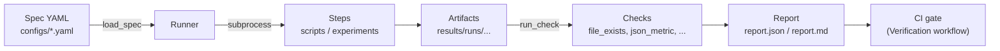
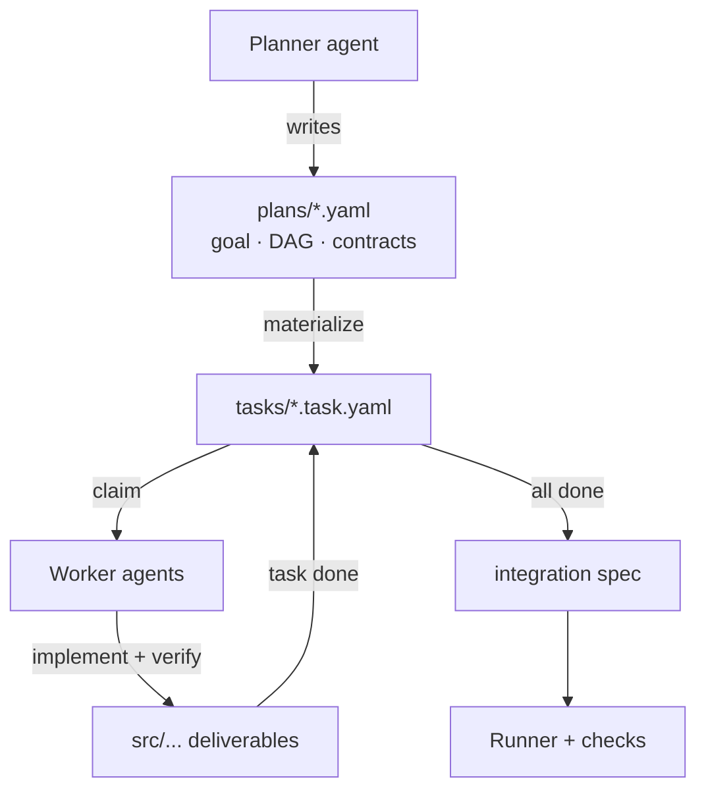

# Harness Template

Standard agent-first harness engineering template for **reproducible research**
and **automated verification workflows**.

Every lab project should be created from this repository as a template. It ships
with a small, dependency-light verification harness that turns declarative YAML
specs into executable, checkable, report-producing pipelines — runnable locally
via `make` and enforced in CI.

## Why

Research code rots because verification is ad-hoc: "run this notebook, eyeball
the numbers." This template makes verification a first-class artifact:

- **Declarative** — what to run and what to check lives in `configs/*.yaml`, not tribal memory.
- **Deterministic** — seeds are explicit; CI re-runs pipelines and compares hashes.
- **Agent-first** — `AGENTS.md` gives AI coding agents (and humans) the same ground rules, and `make verify` is the machine-checkable definition of "done."
- **Reportable** — every run produces `report.json` + `report.md` under `results/runs/`.

## Quickstart

```bash
make setup     # editable install + dev tools (or: bash scripts/bootstrap.sh)
make verify    # run the demo verification spec end-to-end
make test      # pytest suite (includes harness end-to-end tests)
make lint      # ruff check + format check
```

`make verify` runs `configs/demo.yaml`: a seeded step that produces
`output.json`, verified by checks (`file_exists`, `json_metric`), with a report
written to `results/runs/<name>-<timestamp>/`.

## How verification works



A minimal spec:

```yaml
name: my-experiment
seed: 42
steps:
  - id: train
    run: python scripts/train.py --config configs/default.yaml
    timeout: 3600
    checks:
      - type: file_exists
        path: ${HARNESS_RESULTS_DIR}/metrics.json
      - type: json_metric
        path: ${HARNESS_RESULTS_DIR}/metrics.json
        metric: val.accuracy
        min: 0.5
```

Run it with `python -m harness verify --spec configs/my-experiment.yaml`.
Full reference: [docs/verification.md](docs/verification.md).

## Two-tier agent orchestration

Beyond single pipelines, this template orchestrates **multiple agents
hierarchically**: a **Planner** owns direction and flow; **Workers** each own
one module, built in isolation against a self-contained spec.



Try the shipped example end-to-end:

```bash
make plan        # validate plans/demo-pipeline.yaml + refresh tasks
make tasks       # show the board
python -m harness task show --id stats        # a Worker's complete work order
python -m harness verify --spec configs/demo-pipeline.yaml   # Planner's integration gate
```

- **Planner contract**: [agents/planner.md](agents/planner.md)
- **Worker contract**: [agents/worker.md](agents/worker.md)
- **Full reference**: [docs/orchestration.md](docs/orchestration.md)

## Project structure

```
harness-template/
├── AGENTS.md               # Agent-facing ground rules (read this first)
├── Makefile                # setup / lint / test / verify / plan / tasks
├── pyproject.toml          # Project metadata + tool config
├── agents/                 # Role contracts for hierarchical agents
│   ├── planner.md          #   Planner: owns plans, DAGs, contracts, flow
│   └── worker.md           #   Worker: owns one module task, in isolation
├── plans/                  # Orchestration plans (Planner output)
│   └── demo-pipeline.yaml
├── tasks/                  # Materialized work orders (Worker input)
├── harness/                # Core verification harness (Python package)
│   ├── spec.py             #   Spec loading & validation
│   ├── runner.py           #   Step execution engine
│   ├── checks.py           #   Built-in checks + registry
│   ├── report.py           #   JSON/Markdown report generation
│   ├── reproducibility.py  #   Seeding & hashing utilities
│   ├── plan.py             #   Plans: module DAGs + contracts
│   ├── task.py             #   Task lifecycle, board, materialization
│   └── cli.py              #   `python -m harness verify|hash|plan|task`
├── src/                    # Project code (demo_pipeline ships as example)
├── configs/                # Verification & integration specs (YAML)
├── scripts/                # Runnable steps (bootstrap, demo, instantiate)
├── tests/                  # Pytest suite (incl. end-to-end harness tests)
├── docs/                   # Architecture & reference docs
├── data/                   # Datasets (gitignored; see data/README.md)
├── results/                # Run outputs & reports (gitignored)
└── .github/                # CI workflows, issue/PR templates
```

Put project-specific code in a package of your choice (e.g. `src/<project>/`);
the `harness` package is verification infrastructure and stays as-is.

## Creating a new project from this template

**Option A — GitHub UI:** click **"Use this template"** on the repo page, then
clone the generated repository.

**Option B — GitHub CLI:**

```bash
gh repo create <owner>/<new-project> --template teasol/harness-template --clone
cd <new-project>
```

Then instantiate:

```bashorchestration.md](docs/orchestration.md) — two-tier orchestration reference
- [docs/verification.md](docs/verification.md) — spec & check reference
- [docs/reproducibility.md](docs/reproducibility.md) — determinism policy
- [docs/architecture.md](docs/architecture.md) — component overview

## CI

- **CI** (`.github/workflows/ci.yml`): lint + tests on every push/PR.
- **Verification** (`.github/workflows/verify.yml`): runs the harness twice and
  compares output hashes (determinism gate), then validates the orchestration
  plan, verifies every task's acceptance, and runs the integration specributors
- [docs/verification.md](docs/verification.md) — spec & check reference
- [docs/reproducibility.md](docs/reproducibility.md) — determinism policy
- [docs/architecture.md](docs/architecture.md) — component overview

## CI

- **CI** (`.github/workflows/ci.yml`): lint + tests on every push/PR.
- **Verification** (`.github/workflows/verify.yml`): runs the harness twice and
  compares output hashes — a determinism gate on every PR.
