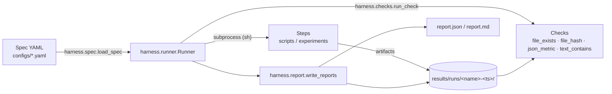

# Architecture

## Components

## Module map

| Module | Responsibility |
| --- | --- |
| `harness/spec.py` | Parse + validate spec YAML into dataclasses (`Spec`, `Step`, `Check`) |
| `harness/runner.py` | Execute steps via `subprocess`, capture logs, evaluate checks, stop on first failure |
| `harness/checks.py` | Check registry; each check is `(root, params) -> detail` and fails via `CheckError` |
| `harness/report.py` | Serialize `RunResult` to JSON + Markdown |
| `harness/reproduce.py` | Determinism gate: repeat a spec, diff artifact manifests |
| `harness/reproducibility.py` | Seeding helpers, deterministic env vars, sha256, run provenance |
| `harness/plan.py` | Plans: module DAGs, contracts, acceptance, report spec — the Planner's output format |
| `harness/experiment.py` | Experiments: worktree/branch lifecycle, Planner briefing, researcher's report |
| `harness/worker.py` | Worker adapters (manual/cli) and the verify-and-retry loop |
| `harness/setup.py` | First-run choice of Worker platform, model, and reasoning level |
| `harness/task.py` | Task materialization, lifecycle (claim/block/done), dependency + deliverable enforcement, board — the Worker's world |
| `harness/cli.py` | `python -m harness verify\|reproduce\|hash\|plan\|task\|exp` |

The layers stack: a task's acceptance is a standard spec run by the standard
Runner ([orchestration.md](orchestration.md)), and an experiment's report is
that same machinery run over a whole plan ([experiments.md](experiments.md)).
One engine, three altitudes.

## Design rules

- **Stdlib + PyYAML only** in the harness core — it must run everywhere,
  including minimal CI images.
- **Specs are data**: no conditionals or templating logic in YAML. If you need
  logic, write a script and reference it from a step.
- **Fail fast**: the runner stops at the first failing step by default
  (`stop_on_failure=False` to collect all failures).
- **Everything leaves a trace**: stdout/stderr, exit codes, durations, check
  details, and run provenance (commit, interpreter, platform, seed) are always
  captured in the run directory.
- **Declared contracts are enforced**: anything a plan or task declares
  (`deliverables`, `depends_on`, report `source` paths) is machine-checked. A
  rule the harness cannot check belongs in prose, and prose is not a gate.
- **Agents report where, the harness reports what**: an agent declares where a
  number lives; the harness reads the artifact. No result reaches the
  researcher on an agent's word alone.
- **The merge is human**: the harness measures readiness and stops. Choosing
  which hypothesis enters the record is the researcher's judgement.
- **The loop belongs to the harness**: invoking a Worker, judging the result,
  retrying with real output, and capping attempts are tested code. An agent
  decides *what* to run, never whether the result was good enough.
- **No vendor in the core**: how a Worker is invoked, and how a Planner is
  registered, are configuration and plain commands. Platform presets are data
  (`configs/agent-platforms.yaml`); tool-specific shims live in
  `integrations/`. Both are optional and neither is referenced by name in code.
- **A tier you cannot choose is not a tier**: platform, model, and reasoning
  level are explicit settings, and both tiers are recorded in the report — so
  the split is auditable, not just intended.
