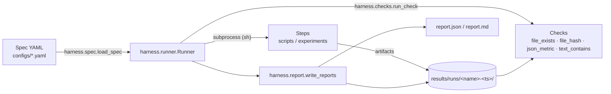

# Architecture

## Components

## Module map

| Module | Responsibility |
| --- | --- |
| `harness/spec.py` | Parse + validate spec YAML into dataclasses (`Spec`, `Step`, `Check`) |
| `harness/runner.py` | Execute steps via `subprocess`, capture logs, evaluate checks, stop on first failure |
| `harness/checks.py` | Check registry; each check is `(root, params) -> detail` and fails via `CheckError` |
| `harness/report.py` | Serialize `RunResult` to JSON + Markdown |
| `harness/reproducibility.py` | Seeding helpers, deterministic env vars, sha256 |
| `harness/plan.py` | Plans: module DAGs, contracts, acceptance — the Planner's output format |
| `harness/task.py` | Task materialization, lifecycle (claim/block/done), board — the Worker's world |
| `harness/cli.py` | `python -m harness verify\|hash\|plan\|task` |

The orchestration layer builds on the verification layer: a task's acceptance
is a standard spec run by the standard Runner (see
[orchestration.md](orchestration.md)).

## Design rules

- **Stdlib + PyYAML only** in the harness core — it must run everywhere,
  including minimal CI images.
- **Specs are data**: no conditionals or templating logic in YAML. If you need
  logic, write a script and reference it from a step.
- **Fail fast**: the runner stops at the first failing step by default
  (`stop_on_failure=False` to collect all failures).
- **Everything leaves a trace**: stdout/stderr, exit codes, durations, and
  check details are always captured in the run directory.
