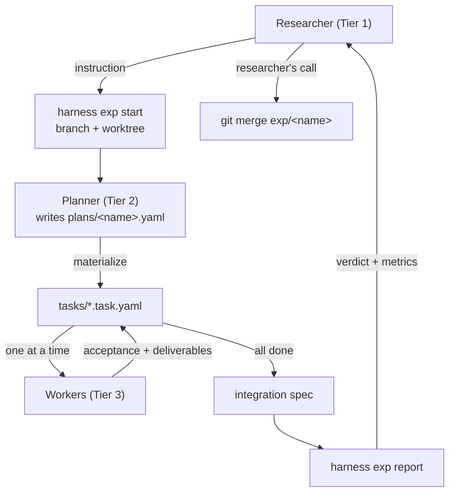

# Experiments reference (Tier 1 ↔ Tier 2)

> New here? Start with the walkthrough at the top of [README.md](../README.md).

An **experiment** is one research hypothesis, developed on its own branch in
its own git worktree. The Planner works there from start to finish; the
researcher reads the resulting report and decides whether to merge.

The harness never merges. Which hypothesis enters the record is the
researcher's judgement — it is the one thing here that is deliberately not
automated.



## The question

An experiment answers one question, and the question is stored with it
(`experiments/<name>/question.md`, committed) and placed at the top of the
Planner's briefing. It is the Planner's only route to knowing what is being
asked: the question's permanent home is the plan's `report.question`, and the
plan is the thing the Planner has not written yet.

**It is not required up front.** A question usually gets sharper by talking it
through, so an experiment can open without one:

```bash
harness exp start <name>                          # no question yet
harness exp question <name>                       # show it (or say there is none)
harness exp question <name> --set "..."           # record it when it settles
harness exp start <name> --question "..."         # or state it up front
```

With no question recorded, the Planner's briefing says so and instructs it to
establish the question with the researcher **before planning or spawning any
Worker**, then record it with `exp question --set`. That conversation is the
point, not an obstacle to it.

`planner run` is the exception: a spawned Planner has nobody to ask, so it
refuses to start without a recorded question rather than inventing a goal and
building something nobody requested. It points at both ways to proceed.

## Why worktrees

A worktree is a second working directory backed by the same repository. Several
experiments can therefore exist on disk simultaneously, each on its own branch,
without checking out and stashing between them.

Isolation is applied at the **experiment** level, not the Worker level. Inside
one experiment, Workers run **sequentially**. That is a deliberate choice:

- A plan's DAG is usually close to a chain (loader → model → train → eval), so
  concurrent Workers would save little wall-clock time.
- Concurrency would fracture the task board. Each Worker would edit its own
  branch's copy of `tasks/`, so the Planner could not see progress and the
  dependency gate would read a stale board — refusing ready tasks and
  admitting unready ones.

Sequential Workers keep the board coherent, keep dependency gates correct, and
keep the board committed in git. If a genuinely wide plan ever needs
parallelism, `ready_task_ids()` already computes which modules could start
together; the door stays open.

## Commands

| Command | Purpose |
| --- | --- |
| `harness exp start <name> [--question "..."] [--base main]` | Create branch `exp/<name>` + worktree, scaffold `plans/<name>.yaml` and its integration spec. The question is optional |
| `harness exp question <name> [--set "..."]` | Show the question, or record one agreed on in conversation |
| `harness exp list` | Every experiment worktree git knows about |
| `harness exp report <name> [--no-run] [--determinism] [--save]` | Build the researcher's decision aid; exits non-zero unless merge-ready |
| `harness exp remove <name> [--force]` | Remove the worktree; **the branch is kept** — it is the record of the attempt |
| `harness planner run <name>` | Spawn a Planner and drive the experiment until it is reportable |

Worktrees default to `.experiments/<name>` inside the repo and are gitignored.
Removing a worktree never deletes the branch, so a rejected experiment remains
inspectable.

## Adopting an existing project

Most projects do not start empty. The order that works:

```bash
pip install research-harness
harness init .                                  # notices the code already here
harness project init                            # what a Planner must know
harness planner create <name> --model <model>   # it outlives this experiment
harness exp start <name> --planner <name>       # the Planner plans the rest
```

`harness init` records how the harness arrived — the commit and how many source
files predate it — so "unverified" has a boundary instead of being a feeling.
Every Planner briefing then opens with that, until some experiment here reaches
a report.

**The harness does not prescribe how to modularize an existing codebase, and
should not.** Deciding the decomposition is exactly the Planner's job; a fixed
pipeline in the tool would take Tier 2's work away and would be wrong for the
next project anyway. What the briefing supplies instead is what generalizes: the
conditions a module boundary has to satisfy — each one a consequence of
something the harness can or cannot enforce — and the ordering principle that in
research code the artifact of record is a *measurement*, so the numbers must be
pinned before anything moves. The Planner may disagree with any of it.

## Project context: what every Planner is told

A harness dropped into an existing project inherits a world it did not build.
Where the numbers of record live, which interpreter has the dependencies, which
directions are already closed — a Planner rediscovers all of it, differently
each time, and a Planner that reads the wrong document plans against the wrong
facts.

```bash
python -m harness project init    # scaffold configs/project.yaml, then edit it
python -m harness project show    # print it, and flag paths that do not exist
```

```yaml
project:
  docs:
    authority: docs/current_status.md      # wins when two sources disagree
    architecture: docs/current_architecture.md
  report_format: docs/current_status.md    # this project's own reporting shape
  environment: scripts/node_env.sh         # resolves per-machine paths
  python: /opt/envs/proj/bin/python        # steps get it as ${PROJECT_PYTHON}
  conventions:
    - "No t-tests on deterministic arms."
```

Every Planner briefing opens with this, and `exp start` copies it into the new
worktree. `project show` exits non-zero when a declared path is missing —
pointing a Planner at a moved file is worse than pointing it at nothing,
because it is told where the truth lives and finds none.

**`docs.authority` is the one that matters.** Point it at the detailed table,
not a summary. Summaries compress, and a compressed figure read as an
authoritative one is how a Planner reports a result nobody measured. This is
not hypothetical: a status document's summary line once read
`SMAD4 0.4282 -> 0.5483` — a single-branch figure — while the authoritative
per-task table said the arm scored `0.4465`.

**`${PROJECT_PYTHON}` is not `${HARNESS_PYTHON}`.** The latter is whatever
interpreter is running the harness, typically a bare `python3` with none of the
project's dependencies. Steps that need the project's packages must use
`${PROJECT_PYTHON}`.

## Planners that outlive one experiment

A Planner spends its first hour learning the project. Discarding that at the
end of every experiment means paying the hour again — and repeating the same
first-time mistakes, because what would have prevented them was never written
down.

```bash
python -m harness planner create icf --model claude-opus-5 --effort high
python -m harness exp start baseline --planner icf     # inherits model + memory
python -m harness planner note icf --experiment baseline \
  --add "ICF_CKPT is empty on this node; that is correct for a training-free arm."
python -m harness planner show icf
```

An experiment started under a registered Planner inherits its model (so it is
never "model not recorded") and opens its briefing with everything that Planner
has learned. The registry lives in the **main** repository, not in a worktree,
so every experiment under one Planner appends to the same memory.

Notes are that Planner's operational findings, carried forward with an explicit
warning that they may have gone stale. Durable project policy belongs in
`project.yaml` instead, which the researcher owns — one is a lab notebook, the
other is the rules.

## Registering a Planner

A Planner can be spawned rather than opened by hand:

```bash
harness planner run <name>
```

That invokes the configured planner tier with its briefing and repeats until
the experiment reaches *ready to report* or the attempt cap is hit — a Worker's
definition of done is its acceptance, a Planner's is the experiment. Useful
when a researcher (or a Tier 1 agent acting for them) is driving several
experiments and does not want to sit inside each one.

One experiment has exactly one Planner, so `exp start` creates both: it prints
the Planner's briefing directly, and registers it. There is no separate
activation step.

`planner brief` is then the *working* briefing — re-read current state at any
time:

```bash
python -m harness planner brief <name>
```

It always has the same sections — **Question**, **State**, **Next**, **Your
role**, **The whole sequence** — whatever the experiment's state; only their
contents change. `Next` always names one real command, never the briefing
itself. A document that changes shape is one you have to re-read; this one you
re-run and skim.

**Tell the agent to run it; do not run it and paste the output.** Any coding
agent with shell access can execute it, and re-run it whenever it needs current
state. A pasted briefing is a snapshot that goes stale as soon as a Worker
finishes; the command always returns the board as it is now.

`--register` re-records the label (and `--model`/`--effort`) if the Planner
changes; `exp start` does it once for you.

This is a plain command producing plain text on purpose. Tool-specific shims
(a slash command, a skill, a saved prompt) are thin optional wrappers around it
— see [integrations/](../integrations/README.md). Binding registration to one
vendor's feature would make the template unusable for anyone with a different
tool.

## Running Workers

The Planner decides *which* task to run; the harness runs it. `task run`
invokes the configured Worker, verifies acceptance **and** deliverables, and
retries with the real failure output until the attempt cap:

```bash
python -m harness task run --id <id>          # one module
python -m harness plan run plans/<plan>.yaml  # drain the ready queue in order
```

Retries keep the same worker and hand it the failing checks and step logs,
rather than starting over: a coding agent given its own failing test usually
fixes it, and continuing preserves context that a fresh start throws away. The
cap (default 6) exists so a wedged worker cannot burn budget forever — on
exhaustion the task is `blocked` with the reason in its log, and control
returns to the Planner.

Configure the adapter in `configs/worker.yaml`:

| Adapter | Behaviour |
| --- | --- |
| `manual` (default) | Write the briefing to a file and stop, for a human to hand to a session. Works with no configuration and no API key — and builds nothing. |
| `cli` | Run a configured shell command — a coding agent in headless mode. **This is what makes the Planner spawn Workers by itself.** The command is *your* configuration; the harness names no vendor. |

### Choosing the tier

```bash
harness setup --list
harness setup                       # interactive: both tiers
harness setup \
  --planner-platform <p> --planner-model <m> --planner-effort <level> \
  --worker-platform  <p> --worker-model  <m> --worker-effort  <level>
```

Both tiers are configured together, in `configs/agents.yaml`, so the split sits
in one file where you can see it. `--planner-session <id>` / `--worker-session
<id>` attach a tier to a session you already have open instead of starting a
fresh one.

A Worker's task is bounded and fully specified, so it can usually run on a
small fast model; keeping the expensive one for planning is the reason to
separate the tiers at all. **A tier you cannot choose is not a tier**, so the
platform, model, and reasoning level are explicit settings rather than
whatever a tool happens to default to. A command that references `{model}` or
`{effort}` without a value configured is refused, so a Worker never silently
runs at the platform default.

Presets live in `configs/agent-platforms.yaml` as **data** — adding a tool, or
a local model, is an entry there rather than a change to `harness/`. Nothing in
the harness core names a vendor.

Both tiers are recorded: `harness planner brief --register <label> --model <m>
--effort <e>` notes what the Planner session runs on (the harness cannot set
it — a person opened that session — but it can record it), and every Worker
invocation writes its platform, model, and effort to the task log and the
worker report. `exp report` shows both under **Tiers**, so which model built
what is auditable rather than merely intended.

Because the default is `manual`, automatic Workers are off until you turn them
on. `harness status` and `plan run` both say so rather than letting you wonder
why nothing was built. `configs/worker.yaml` carries worked examples for
several coding agents; check their flags against your installed version.

The briefing contains the task's brief, contract, deliverables, constraints,
and the exact acceptance commands that will judge the work. It reaches the
command two ways, so any tool fits: on **stdin**, and as a file via the
`{brief_file}` placeholder (`{task_id}`, `{task_file}`, and `{root}` are also
substituted).

A Worker edits files unattended, so it runs with permission prompts relaxed.
An experiment worktree is the right place for that: it is isolated, and its
branch is disposable.

### On cost

The harness does **not** estimate token spend. It records what it can observe —
attempts, durations, exit codes, the configured adapter — and reports
`cost: not measured` when the adapter provides none. Guessing a number here
would be the same failure as an agent narrating an unmeasured result.

## The report

The report has two layers, and the split is the point.

**The spine is measured, not narrated.** Integration result, per-task
acceptance re-verification, determinism, the exact commit to merge, and a
`Not verified` section — all produced by the harness. An agent cannot assert
that its experiment worked; the harness decides.

**The payload is what the researcher asked for.** The researcher states what
they want to see when instructing the Planner. The Planner records *where each
number lives*; the harness extracts the value from the artifact the run
actually produced. The Planner chooses the mapping and never supplies a value.

```yaml
plan:
  name: my-experiment
  report:
    question: |
      The researcher's instruction, verbatim.
    metrics:
      - name: val_accuracy
        source: ${HARNESS_RESULTS_DIR}/metrics.json   # where
        metric: val.accuracy                          # which key
    artifacts:
      - loss_curve.png
```

### Self-containment is enforced

A report may only draw on **its own** experiment's artifacts. `source` and
`artifacts` paths may not be absolute and may not escape via `..`;
`plan validate` rejects them:

```
error: report metric 'acc' source must stay inside the experiment:
'../exp-baseline/results/stats.json' escapes via '..'.
Comparing experiments is the researcher's job, not the plan's.
```

Comparing experiments belongs to Tier 1: the researcher collects finished
reports and weighs them. An experiment that reaches into another cannot be
judged on its own terms, so the harness refuses to produce one. Every report is
also written as `report.json`, which makes that collection straightforward.

### Merge readiness

`exp report` exits `0` only when integration passed, every module is `done`,
every task's acceptance still passes, the worktree is clean, and determinism
(if checked) held. Anything short of that prints `NOT READY` and exits `1`,
and **every** blocker is stated under `Why not ready` — a verdict the
researcher cannot explain is not a decision aid.

Progress is counted against the plan's own modules. A `tasks/` directory can
hold task files from other plans; counting those would report an experiment
complete when none of its modules were built, and that number decides a merge.
Foreign task files are ignored and listed as a caveat.

`--save` also writes the report to `experiments/<name>/report.md` inside the
branch, so merging carries the evidence into the record. Without it the report
lives only under `results/` and is gitignored.

## Typical flow

```bash
# Researcher
python -m harness exp start sparse-attn --question "does top-k attention keep the mass?"
python -m harness planner brief sparse-attn --register session-01

# Planner, inside .experiments/sparse-attn/
# (exp start scaffolds plans/<name>.yaml and configs/<name>.yaml; fill in the
#  TODOs first — plan validate refuses a scaffold)
python -m harness plan validate plans/sparse-attn.yaml
python -m harness plan materialize plans/sparse-attn.yaml

# Workers, one at a time (see agents/worker.md)
python -m harness plan run plans/sparse-attn.yaml

# Planner closes the loop, then hands back
python -m harness exp report sparse-attn --determinism --save

# Researcher decides
git merge exp/sparse-attn
```

## Code in a worktree

The runner puts the tree being verified at the front of `PYTHONPATH` (its root
and `src/`), so a step run inside an experiment worktree imports **that**
experiment's code. Without it an editable install would point every worktree at
the main checkout, and experiments would silently verify the wrong source.
