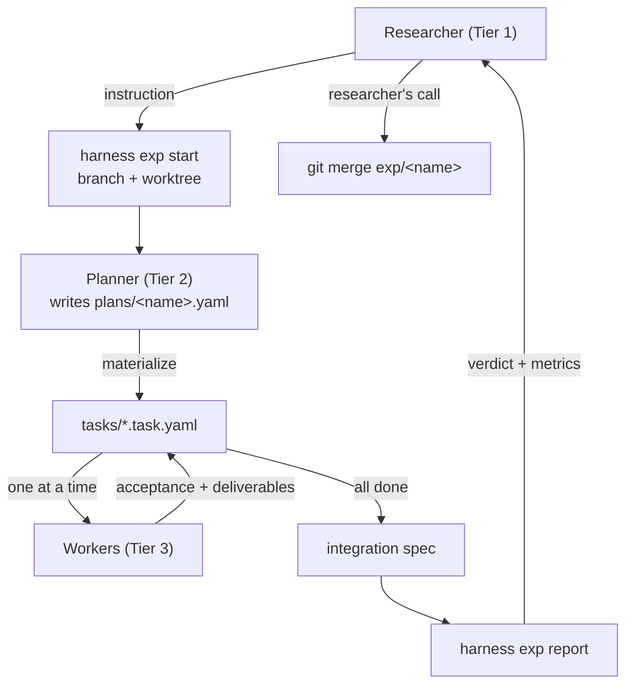

# Experiments reference (Tier 1 ↔ Tier 2)

> New here? Start with [getting-started.md](getting-started.md).

An **experiment** is one research hypothesis, developed on its own branch in
its own git worktree. The Planner works there from start to finish; the
researcher reads the resulting report and decides whether to merge.

The harness never merges. Which hypothesis enters the record is the
researcher's judgement — it is the one thing here that is deliberately not
automated.



## Why worktrees

A worktree is a second working directory backed by the same repository. Several
experiments can therefore exist on disk simultaneously, each on its own branch,
without checking out and stashing between them.

Isolation is applied at the **experiment** level, not the Worker level. Inside
one experiment, Workers run **sequentially**. That is a deliberate choice:

- A plan's DAG is usually close to a chain (loader → model → train → eval), so
  concurrent Workers would save little wall-clock time.
- Concurrency would fracture the task board. Each Worker would edit its own
  branch's copy of `tasks/`, so the Planner could not see progress and the
  dependency gate would read a stale board — refusing ready tasks and
  admitting unready ones.

Sequential Workers keep the board coherent, keep dependency gates correct, and
keep the board committed in git. If a genuinely wide plan ever needs
parallelism, `ready_task_ids()` already computes which modules could start
together; the door stays open.

## Commands

| Command | Purpose |
| --- | --- |
| `harness exp start <name> [--base main] [--path DIR]` | Create branch `exp/<name>` + worktree, scaffold `plans/<name>.yaml` |
| `harness exp list` | Every experiment worktree git knows about |
| `harness exp report <name> [--no-run] [--determinism] [--save]` | Build the researcher's decision aid; exits non-zero unless merge-ready |
| `harness exp remove <name> [--force]` | Remove the worktree; **the branch is kept** — it is the record of the attempt |

Worktrees default to `.experiments/<name>` inside the repo and are gitignored.
Removing a worktree never deletes the branch, so a rejected experiment remains
inspectable.

## Registering a Planner

A session becomes an experiment's Planner by running one command and following
its output:

```bash
python -m harness planner brief <name> --register <label>
```

It prints the role contract to read, the worktree and branch owned, the plan's
state, the module board, the commands to run, and how to hand back. `--register`
records the label so `exp list` shows who is driving which experiment.

This is a plain command producing plain text on purpose. Tool-specific shims
(a slash command, a skill, a saved prompt) are thin optional wrappers around it
— see [integrations/](../integrations/README.md). Binding registration to one
vendor's feature would make the template unusable for anyone with a different
tool.

## Running Workers

The Planner decides *which* task to run; the harness runs it. `task run`
invokes the configured Worker, verifies acceptance **and** deliverables, and
retries with the real failure output until the attempt cap:

```bash
python -m harness task run --id <id>          # one module
python -m harness plan run plans/<plan>.yaml  # drain the ready queue in order
```

Retries keep the same worker and hand it the failing checks and step logs,
rather than starting over: a coding agent given its own failing test usually
fixes it, and continuing preserves context that a fresh start throws away. The
cap (default 6) exists so a wedged worker cannot burn budget forever — on
exhaustion the task is `blocked` with the reason in its log, and control
returns to the Planner.

Configure the adapter in `configs/worker.yaml`:

| Adapter | Behaviour |
| --- | --- |
| `manual` (default) | Write the briefing to a file and stop, for a human to hand to a session. Works with no configuration and no API key. |
| `cli` | Run a configured shell command — a coding agent in headless mode. The command is *your* configuration; the harness names no vendor. |

The briefing is passed on stdin and contains the task's brief, contract,
deliverables, constraints, and the exact acceptance commands that will judge
the work.

### On cost

The harness does **not** estimate token spend. It records what it can observe —
attempts, durations, exit codes, the configured adapter — and reports
`cost: not measured` when the adapter provides none. Guessing a number here
would be the same failure as an agent narrating an unmeasured result.

## The report

The report has two layers, and the split is the point.

**The spine is measured, not narrated.** Integration result, per-task
acceptance re-verification, determinism, the exact commit to merge, and a
`Not verified` section — all produced by the harness. An agent cannot assert
that its experiment worked; the harness decides.

**The payload is what the researcher asked for.** The researcher states what
they want to see when instructing the Planner. The Planner records *where each
number lives*; the harness extracts the value from the artifact the run
actually produced. The Planner chooses the mapping and never supplies a value.

```yaml
plan:
  name: my-experiment
  report:
    question: |
      The researcher's instruction, verbatim.
    metrics:
      - name: val_accuracy
        source: ${HARNESS_RESULTS_DIR}/metrics.json   # where
        metric: val.accuracy                          # which key
    artifacts:
      - loss_curve.png
```

### Self-containment is enforced

A report may only draw on **its own** experiment's artifacts. `source` and
`artifacts` paths may not be absolute and may not escape via `..`;
`plan validate` rejects them:

```
error: report metric 'acc' source must stay inside the experiment:
'../exp-baseline/results/stats.json' escapes via '..'.
Comparing experiments is the researcher's job, not the plan's.
```

Comparing experiments belongs to Tier 1: the researcher collects finished
reports and weighs them. An experiment that reaches into another cannot be
judged on its own terms, so the harness refuses to produce one. Every report is
also written as `report.json`, which makes that collection straightforward.

### Merge readiness

`exp report` exits `0` only when integration passed, every module is `done`,
every task's acceptance still passes, the worktree is clean, and determinism
(if checked) held. Anything short of that prints `NOT READY` and exits `1`,
and **every** blocker is stated under `Why not ready` — a verdict the
researcher cannot explain is not a decision aid.

Progress is counted against the plan's own modules. A `tasks/` directory can
hold task files from other plans; counting those would report an experiment
complete when none of its modules were built, and that number decides a merge.
Foreign task files are ignored and listed as a caveat.

`--save` also writes the report to `experiments/<name>/report.md` inside the
branch, so merging carries the evidence into the record. Without it the report
lives only under `results/` and is gitignored.

## Typical flow

```bash
# Researcher
python -m harness exp start sparse-attn --base main
python -m harness planner brief sparse-attn --register session-01

# Planner, inside .experiments/sparse-attn/
# (exp start scaffolds plans/<name>.yaml and configs/<name>.yaml; fill in the
#  TODOs first — plan validate refuses a scaffold)
python -m harness plan validate plans/sparse-attn.yaml
python -m harness plan materialize plans/sparse-attn.yaml

# Workers, one at a time (see agents/worker.md)
python -m harness plan run plans/sparse-attn.yaml

# Planner closes the loop, then hands back
python -m harness exp report sparse-attn --determinism --save

# Researcher decides
git merge exp/sparse-attn
```

## Code in a worktree

The runner puts the tree being verified at the front of `PYTHONPATH` (its root
and `src/`), so a step run inside an experiment worktree imports **that**
experiment's code. Without it an editable install would point every worktree at
the main checkout, and experiments would silently verify the wrong source.
