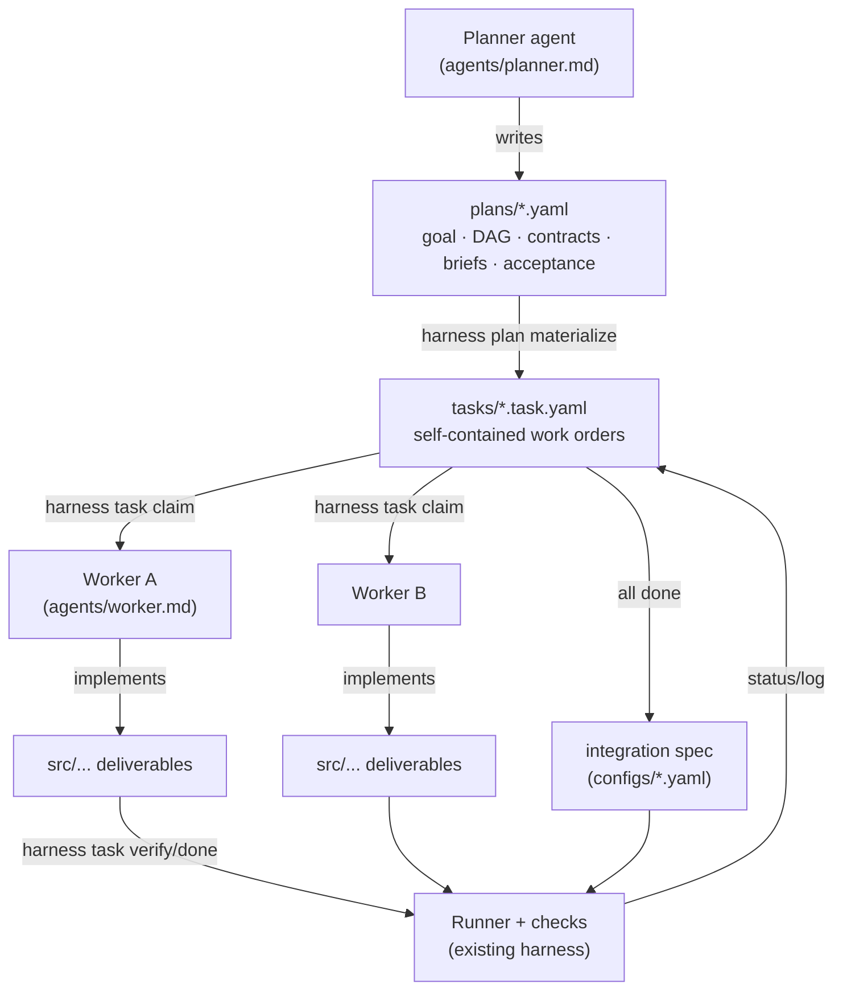
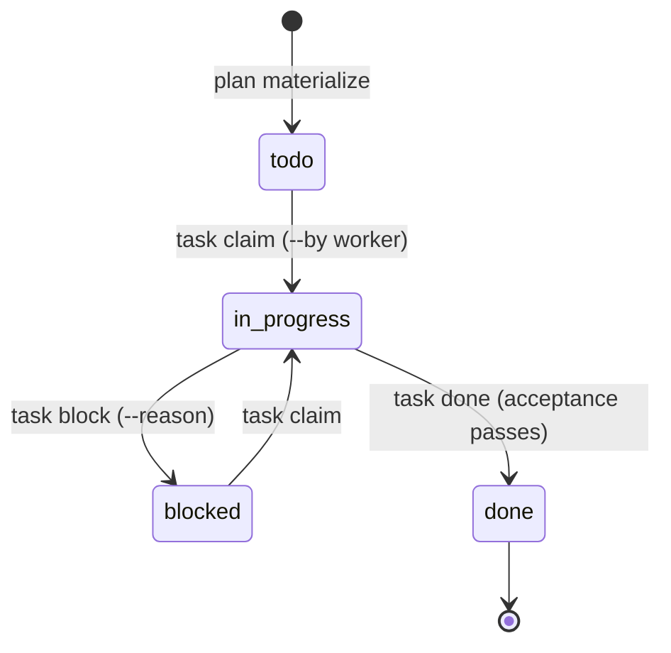

# Orchestration reference

This document covers Tier 2 ↔ Tier 3. The tier above — experiments, worktrees,
and the report a researcher reads to decide a merge — is in
[experiments.md](experiments.md).

This template implements a **two-tier agent harness**: a Planner agent owns
the direction and the module DAG; Worker agents each own one module, built in
isolation against a self-contained spec. The harness is the contract between
them — everything machine-checkable is enforced, everything else is written
down.



## Lifecycle



Task state lives inside each task file (`status`, `worker`, `log`), so agents
coordinate through ordinary git commits.

## Commands

| Command | Role | Purpose |
| --- | --- | --- |
| `harness plan validate <plan>` | Planner | Check schema, DAG (cycles, unknown deps), acceptance check types |
| `harness plan materialize <plan>` | Planner | Write `tasks/<id>.task.yaml` per module (skips existing; `--force` refreshes the spec but preserves `status`/`worker`/`log`) |
| `harness plan check` | both | Validate **every** plan in `plans/` and flag drift — names no plan, so gates keep working as plans come and go |
| `harness plan status <plan> [--check]` | Planner | Module progress, integration pointer, and plan/task drift (`--check` exits non-zero on drift) |
| `harness task list [--status S]` | both | The board; `READY=yes` = todo + all deps done |
| `harness task show --id <id>` | Worker | Print the full work order |
| `harness task claim --id <id> --by <name>` | Worker | todo/blocked → in_progress; refused unless every dependency is `done` (`--force` overrides and logs it) |
| `harness task block --id <id> --reason "..."` | Worker | Park a task with a reason for the Planner |
| `harness task verify --id <id>` | Worker | Run the task's acceptance steps + assert declared deliverables exist |
| `harness task verify --all [--status S]` | Planner | Audit the whole board — re-verify every task (CI uses `--status done`) |
| `harness task done --id <id> [--by <name>]` | Worker | Verify, then mark done (fails if acceptance fails) |
| `harness verify --spec <spec>` | Planner | Integration check of the assembled whole |

## Plan schema (`plans/*.yaml`)

```yaml
plan:
  name: my-plan            # required
  goal: >                  # required, one paragraph
    ...
  description: ...         # optional
  integration:             # optional: spec run after ALL modules are done
    spec: configs/my-plan.yaml
  modules:                 # required, non-empty; forms a DAG
    - id: module-a         # unique
      title: ...           # human label
      depends_on: []       # ids of modules whose outputs this consumes
      deliverables: [src/x/a.py]
      contract:
        inputs:  [{name: seed, type: int, description: ...}]
        outputs: [{name: dataset, type: path, description: ...}]
      brief: |             # the Worker's complete instructions
        ...
      constraints: [...]   # hard rules for the Worker
      acceptance:          # mini verification spec (same schema as configs/)
        steps:
          - id: check-a
            run: <shell command>
            checks: [{type: file_exists, path: ...}]
```

Validation enforces: unique ids, resolvable `depends_on`, acyclic DAG,
non-empty brief and acceptance per module, known check types, deliverables
owned by exactly one module, report paths that stay inside the experiment, and
(if set) an existing integration spec file.

## Task schema (`tasks/*.task.yaml`)

Materialized from a plan — a Worker needs this file and nothing else:

```yaml
task:
  id: module-a
  plan: my-plan
  title: ...
  depends_on: []
  brief: |            # copied from the plan module
  contract: {...}     # copied
  deliverables: [...]
  constraints: [...]
  acceptance: {steps: [...]}
  status: todo        # todo | in_progress | done | blocked
  worker: null        # set on claim
  log: []             # append-only audit trail (timestamps + events)
```

Task files are machine-managed (`harness task ...` rewrites them); keep them
comment-free so round-trips stay clean.

`tasks/` may hold task files from more than one plan — a project's earlier
plan, or the shipped demo. Progress is therefore always counted **against the
plan's own modules**: `plan status` and `exp report` ignore foreign task files
and say so, rather than counting someone else's finished work as this plan's.

## Design rules

- **Acceptance reuses the verification harness.** A task's acceptance is a
  standard spec (steps + checks) executed by the same Runner — one engine
  everywhere.
- **Declared contracts are enforced, not trusted.** `deliverables` are checked
  by the harness as a synthetic `deliverables` step appended to every task
  verification: acceptance passing while a declared file is missing is a
  failure, not a pass.
- **The DAG is enforced at claim time.** `task claim` refuses a task whose
  dependencies are not `done`, so a Worker cannot burn a session failing
  acceptance against inputs that do not exist yet. `--force` exists for the
  Planner's deliberate exceptions and writes the override into the log.
- **Re-materialization never erases the board.** `--force` re-syncs the
  spec (brief, contract, acceptance, deliverables, constraints) from the plan
  and keeps `status`, `worker`, and `log`, appending a re-materialization
  entry.
- **Acceptance must be self-contained.** It may invoke dependency CLIs to
  prepare its inputs; it must never depend on another task having run first
  in the same session.
- **Contracts are the only coupling.** Workers consume dependencies through
  declared interfaces (CLI, file formats), never through imports of each
  other's internals.
- **The board lives in git.** Status and log are plain YAML in task files;
  agents commit them alongside their code.

## Adding a module to a running plan

1. Planner edits `plans/<plan>.yaml` (append the module).
2. `harness plan validate` → `harness plan materialize` (writes only the new
   task file; existing tasks untouched).
3. A Worker claims the new task like any other.

## Changing a module's contract mid-flight

1. Planner edits the module in `plans/<plan>.yaml`.
2. `harness plan materialize <plan> --force` — the task file's brief,
   contract, acceptance, and deliverables are refreshed from the plan; its
   `status`, `worker`, and `log` survive, and the refresh is appended to the
   log so the Worker can see the ground shifted.
3. Tell the assigned Worker to re-read the task (`harness task show`).

Skipping step 2 leaves the task file stale, so `harness plan status --check`
(also `make drift`, a pre-commit hook, and a CI step) fails whenever a plan and
its task files disagree on any plan-owned field.
